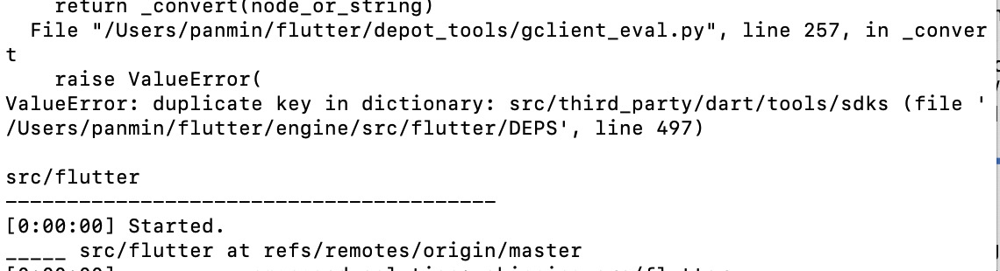
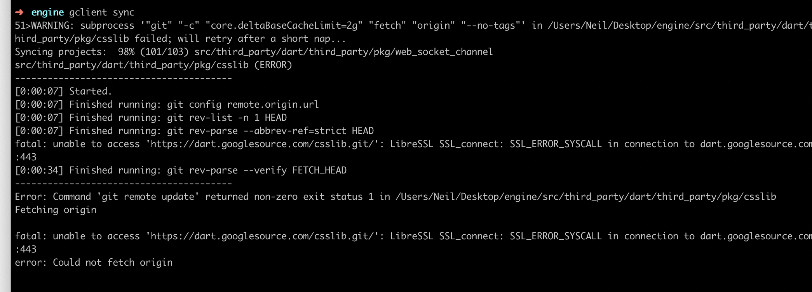

## Flutter engine编译环境搭建

> 继Flutter启动流程分析后，我们来搭建一个可编译的flutter engine的环境，为我们实现flutter的动态化打下基础。
>
> 以下都是在mac系统下操作的，其他系统请查看官方文档。

### 一、可翻墙网络环境

> 最最最重要的是有个一个好用的可**翻墙**的网络环境，好的网络环境能减少80%的时间，好多小伙伴都是卡在这一步了

#### 1.1、v2ray的下载

本人用的就是这一款翻墙软件，大家可以百度一下找个下载链接，然后去找个能用的key，具体的请大家自行百度。

#### 1.2、v2ray的使用

* 使用PAC MODE，遇到不能访问不了的网站时尝试编辑pac.js，添加对应的域名

* 在终端上使用时，首先执行代理命令（不执行的话，终端上是无法翻墙的），如下

  ```json
  export http_proxy="http://127.0.0.1:8001"; export HTTP_PROXY="http://127.0.0.1:8001"; export https_proxy="http://127.0.0.1:8001"; export HTTPS_PROXY="http://127.0.0.1:8001"
  ```

### 二、下载flutter engine相关代码

> 下载flutter engine相关代码并不是把github上的flutter engine代码clone下来就行的，engine的编译环境依赖于使用depot_tools工具的gclient来自动下载代码以及编译过程中需要的依赖库代码

#### 2.1、fork flutter engine的代码库以及各种编译依赖库

> 由于通过github fork的代码库下载速度依旧很慢，我这里使用了码云来clone一份代码

* 打开gitee.com，从url导入仓库https://github.com/flutter/engine
* 等待导入成功

#### 2.2、配置depot_tools工具

* 下载depot_tools源码库

  ```shell
  git clone https://chromium.googlesource.com/chromium/tools/depot_tools.git
  ```

* 配置环境变量

  ```shell
  vim ~/.bash_profile
  #新增环境变量
  export PATH=$PATH:/Users/xxx/flutter/depot_tools #此处使用clone源码到本地的地址
  #刷新环境变量缓存，使生效
  source ~/.bash_profile
  ```

#### 2.3、flutter engine下载需要的配置

* 创建一个engine代码放置的文件夹`engine`

  ```shell
  mkdir engine
  ```

* 进入`engine`文件夹中，创建`.gclient`文件，里面配置下载项

  ```shell
  cd engine
  vim .gclient
  #配置以下内容
  solutions = [
    {
      "managed": False,
      "name": "src/flutter",
      "url": "git@gitee.com:panmin/engine.git",#此处配置自己fork库的地址
      "custom_deps": {},
      "deps_file": "DEPS",
      "safesync_url": "",
    },
  ]
  ```

* 配置好了，我们可以开始下载了

  ```shell
  gclient sync --verbose #设置--verbose可以看到下载的过程，方便下载过程中出现问题看到异常信息
  ```

#### 2.4、查看其他配置是否存在

* java SDK环境需要是1.8

  ```shell
  java -version 
  ```

* ant是否安装

  ```shell
  brew install ant
  ```

### 三、编译环境配置过程中一些常见的问题

#### 3.1、gclient sync卡住不动

* 可以加上--verbose，这样就能看到具体的下载日志了
* ctrl+c直接终止命令行操作，重新在终端上执行代理` export http_proxy="http://127.0.0.1:8001"; export HTTP_PROXY="http://127.0.0.1:8001"; export https_proxy="http://127.0.0.1:8001"; export HTTPS_PROXY="http://127.0.0.1:8001"`，然后试验下`curl https://www.google.com`是否有返回值，若无返回值说明当前网络还是存在问题的，可以尝试重启机器等多种操作

#### 3.2、gclient sync过程中出现异常终止

##### 3.2.1、场景一

> depot_tools中报错，提示**ValueError: deplicate key in dictionary**，出现这种字样一半都是fork的官方源码库需要同步了



​	我们来分析一下这个问题的原因，错误提示说的很明显了，在`src/flutter/DEPS`中配置出现了重复的key，打开项目目录去看看这个文件果然是这样，`gclient`就是通过`DEPS`这个配置文件去下载依赖库的，这个文件出了问题肯定会终止操作的。

​	到github的flutter engine源码库看下，发现官方并没有这个问题，所以需要我们的fork库**同步**一下**官方仓库**。具体同步方法请自行百度。

##### 3.2.2、场景二

> 终端提示**unable to access '.......': SSL_ERROR_SYNCALL in connection on xxx:443**



通过错误信息可以看到这个网址使用https协议打不开，我们尝试复制这个网址到浏览器中试试是否能够访问，如果不能访问，我们就配置一下`v2ray`:

1. `PAC-MODE` --> `Edit pac file`

2. 在`domains`节点下添加对应不能访问的域名，如此图中的

   ```js
   var domains = [
   	...
   	"dart.googlesource.com"
   ]
   ```

3. 退出`v2ray`，然后再次打开
4. 再在浏览器中试下是否能够打开此域名，这次应该是能够打开的，问题解决

