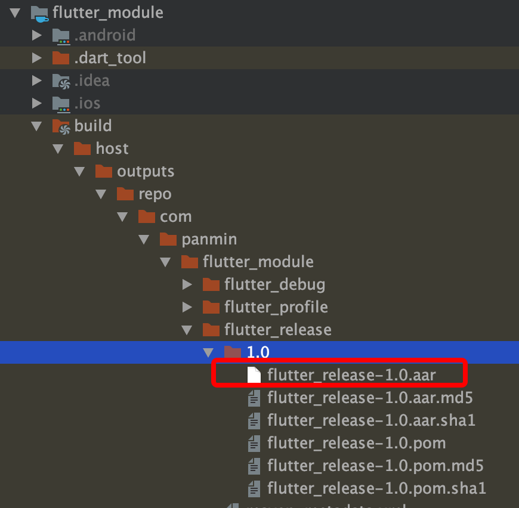
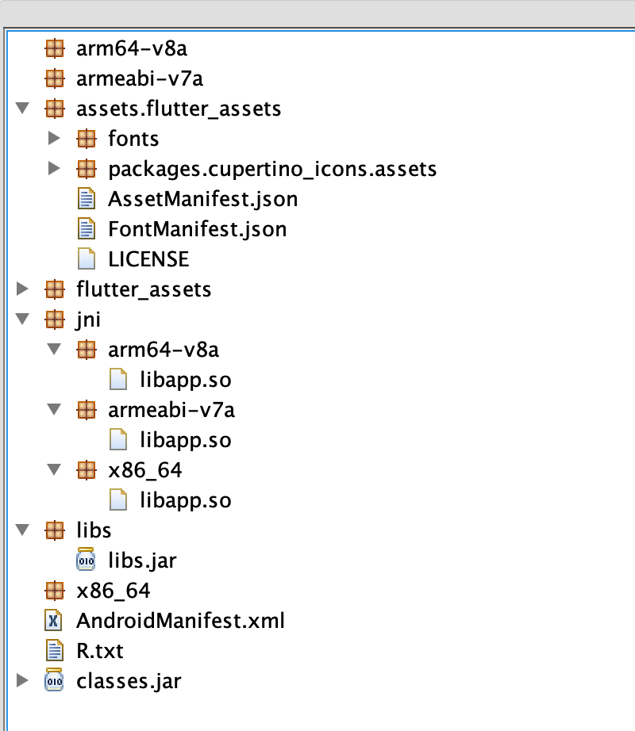
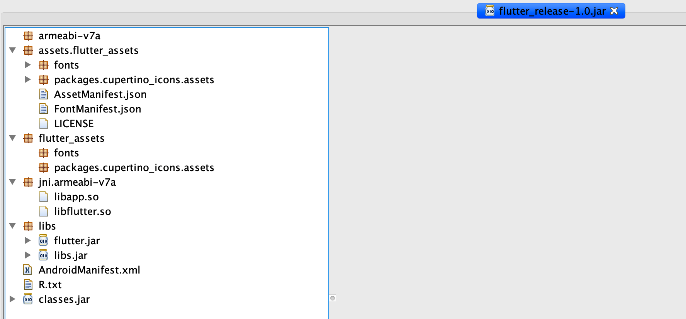

## Flutter动态化-Android（二）

> 上一篇文章我们已经了解如何修改flutter engine代码实现动态化效果，这一篇文章主要是讲解，flutter build aar的过程，然后修改对应的gradle编译脚本，目的是打出适合混合工程使用的aar包。

### 一、flutter build aar打包结果

> 这一小节，我们先来看下正常使用`flutter build aar`打包出的aar的结构是怎么样的

#### 1.1、前置条件

Android混合工程，先创建一个新的Android项目，然后新建`flutter module`，也可以使用`flutter create -t module --org com.example flutter_module`创建。

`cd flutter_module`，然后执行`flutter pub get`，会自动创建`.android`文件

#### 1.2、执行flutter build aar



我们这里只分析release版本的aar，将`flutter_release-1.0.aar`的后缀修改成**jar**，然后用反编译工具**JD-GUI**打开`flutter_release-1.0.jar`，结果如下：



可以看到打包的代码中没有`flutter.jar`的代码，也没有`libflutter.so`，那么这两个文件放在哪儿了呢？

如何将这两个文件打包到aar中呢？带着问题我们来看下执行`flutter build aar`过程中都执行了哪些脚本。

*这里先提一个解决方案，那就是`fat-aar`来打包aar，具体使用请大家自行百度*

### 二、flutter build aar的过程解析

> 关于flutter命令的执行流程，里面的东西还是挺多的，我会单独拿一篇文章来写，这一小节，主要介绍build过程中涉及到的两个gradle文件：`flutter.gradle`、`aar_init_script.gradle`

#### 2.1、flutter.gradle

在`:Flutter`的build.gradle中引用了`apply from: "$flutterRoot/packages/flutter_tools/gradle/flutter.gradle"`

```groovy
// 引用plugin
apply plugin: FlutterPlugin
// 紧接着是plugin的实现
class FlutterPlugin implements Plugin<Project> {
  void apply(Project project) {
    // 创建扩展字段source、target
    project.extensions.create("flutter", FlutterExtension)
    // 其他任务完成后执行addFlutterTasks（设置flutter相关初始化项）
    project.afterEvaluate this.&addFlutterTasks
    
    // abi相关配置
    if (shouldSplitPerAbi())
    。。。
    。。。
    
    // 获取engine的版本，方便从maven上下载
    engineVersion = useLocalEngine() ? "+" : "1.0.0-" + Paths.get(flutterRoot.absolutePath, "bin", "internal", "engine.version").toFile().text.trim()
    。。。
    // 使用本地engine时的配置获取，需要在gradle.properties中配置
    if (useLocalEngine()) {
      // This is required to pass the local engine to flutter build aot.
      String engineOutPath = project.property('local-engine-out')
      File engineOut = project.file(engineOutPath)
      if (!engineOut.isDirectory()) {
        throw new GradleException('local-engine-out must point to a local engine build')
      }
      localEngine = engineOut.name
      localEngineSrcPath = engineOut.parentFile.parent
    }
    // 每种type类型添加dependencies
    project.android.buildTypes.each this.&addFlutterDependencies
    project.android.buildTypes.whenObjectAdded this.&addFlutterDependencies
  }
}
```

核心的就是这个`apply`方法，主要是配置`dependencies`和其他一些相关配置，下面我们来看看`addFlutterDependencies`方法做了哪些事情：

```groovy
/**
* Adds the dependencies required by the Flutter project.
* This includes:
*    1. The embedding
*    2. libflutter.so
*/
// 只看这个注释就能知道，这个方法是用于添加flutter.jar和libflutter.so的
void addFlutterDependencies(buildType) {
  String flutterBuildMode = buildModeFor(buildType)
  // 只有在使用本地engine时supportsBuildMode会判断gradle.properites中的local-engine-build-mode是否和当前flutterBuildMode相同
  if (!supportsBuildMode(flutterBuildMode)) {
    return
  }
  // 设置maven源路径
  String repository = useLocalEngine() ? project.property('local-engine-repo') : MAVEN_REPO
  project.rootProject.allprojects {
    repositories {
      maven {
        url repository
      }
    }
  }
  // Add the embedding dependency.
  // 添加flutter.jar引用
  addApiDependencies(project, buildType.name,   "io.flutter:flutter_embedding_$flutterBuildMode:$engineVersion")

  。。。
  platforms.each { platform ->
    String arch = PLATFORM_ARCH_MAP[platform].replace("-", "_")
    // 添加libflutter.so依赖
    addApiDependencies(project, buildType.name,
                       "io.flutter:${arch}_$flutterBuildMode:$engineVersion")
  }
}
```

#### 2.2、aar_init_script.gradle

> 这个脚本是会有flutter build aar触发的，文件路径`$flutterRoot/packages/flutter_tools/gradle/aar_init_script.gradle`

```groovy
projectsEvaluated {
    assert rootProject.hasProperty("is-plugin")
    if (rootProject.property("is-plugin").toBoolean()) {
        assert rootProject.hasProperty("output-dir")
        // In plugin projects, the root project is the plugin.
        configureProject(rootProject, rootProject.property("output-dir"))
        return
    }
    // 针对混合工程时的 `:flutter` module
    Project moduleProject = rootProject.subprojects.find { it.name == "flutter" }
    assert moduleProject != null
    assert moduleProject.hasProperty("output-dir")
    configureProject(moduleProject, moduleProject.property("output-dir"))

    // 获取所有的plugin子工程
    Set<Project> modulePlugins = rootProject.subprojects.findAll {
        it.name != "flutter" && it.name != "app"
    }
    modulePlugins.each { pluginProject ->
        configureProject(pluginProject, moduleProject.property("output-dir"))
        moduleProject.android.libraryVariants.all { variant ->
            String variantName = variant.name.capitalize()
	          // 插件的`assembleAar$variantName`任务执行完后再执行moduleProject的任务
            moduleProject.tasks.findByPath("assembleAar$variantName")
                .dependsOn(pluginProject.tasks.findByPath("assembleAar$variantName"))
        }
    }
}
```

上面是入口方法，从上面的脚本里能看出有一个核心的方法`configureProject`，下面我们来看看这个方法的作用：

```groovy
void configureProject(Project project, String outputDir) {
  	// 保证是Android工程
    if (!project.hasProperty("android")) {
        throw new GradleException("Android property not found.")
    }
  	// 保证是library而不是application
    if (!project.android.hasProperty("libraryVariants")) {
        throw new GradleException("Can't generate AAR on a non Android library project.");
    }
		// 使用maven插件
    project.apply plugin: "maven"

    project.android.libraryVariants.all { variant ->
      	// 在上传maven任务完成后再执行这个任务
        addAarTask(project, variant)
    }
   
  	// 上传的maven路径，此处是maven的本地库的一个用法
    project.version = project.version.replace("-SNAPSHOT", "")
    project.uploadArchives {
        repositories {
            mavenDeployer {
                repository(url: "file://${outputDir}/outputs/repo")
            }
        }
    }
    if (!project.property("is-plugin").toBoolean()) {
        return
    }
  	// build aar目前暂时不支持使用本地engine
    if (project.hasProperty('localEngineOut')) {
        throw new GradleException(
            "Local engine isn't supported when building the plugins as AAR. " +
            "See: https://github.com/flutter/flutter/issues/40866")
    }

		// 添加仓库以及依赖
    project.repositories {
        maven {
            url "http://download.flutter.io"
        }
    }
    String engineVersion = Paths.get(getFlutterRoot(project), "bin", "internal", "engine.version").toFile().text.trim()
    project.dependencies {
				// 添加flutter.jar依赖
        compileOnly ("io.flutter:flutter_embedding_release:1.0.0-$engineVersion") {
            // 我们只需要暴漏出io.flutter.plugin.*
            // 不需要暴漏依赖项，transitive的默认值是true，gradle会自动添加子依赖，此处表示不添加子依赖
            transitive = false
        }
    }
}
```

这个方法的主要作用就是添加完依赖项后执行上传maven任务，下面来看看上传的方法`addAarTask`：

```groovy
void addAarTask(Project project, variant) {
    String variantName = variant.name.capitalize()
    String taskName = "assembleAar$variantName"
    project.tasks.create(name: taskName) {
				//检查是否配置`uploadArchives`
        if (!project.gradle.startParameter.taskNames.contains(taskName)) {
            return
        }
      	// 以下是上传maven配置
        project.uploadArchives.repositories.mavenDeployer {
            pom {
                artifactId = "${project.name}_${variant.name.toLowerCase()}"
            }
        }
        overrideDefaultPublishConfig(project, variant)
        // Generate the Maven artifacts.
        finalizedBy "uploadArchives"
    }
}
```

上面两个核心的打包aar的脚本我们已经介绍完了，下一小节我们看如何修改这个脚本

### 三、如何修改gradle打包aar脚本

> 我们修改打包脚本的主要原因是：
>
> 1. 打包aar时能使用本地engine
> 2. 将修改后的本地engine打包到aar中，也就是engine产物`flutter.jar`和`libflutter.so`文件打包进aar

#### 3.1、修改`flutter.gradle`中的`addFlutterDependencies`

```groovy
void addFlutterDependencies(buildType) {
  String flutterBuildMode = buildModeFor(buildType)
  if (!supportsBuildMode(flutterBuildMode)) {
    return
  }
  // add local engine dependencies by panmin [start]
  // 当使用本地engine时添加flutter.jar和libflutter.so文件依赖
  if(useLocalEngine()){
    String engineOutPath = project.property('local-engine-out')
    File engineOut = project.file(engineOutPath)
    if (!engineOut.isDirectory()) {
      throw new GradleException('local-engine-out must point to a local engine build')
    }
    // 本地engine的flutter.jar文件路径
    File flutterJar = Paths.get(engineOut.absolutePath, "flutter.jar").toFile()
    if (!flutterJar.isFile()) {
      throw new GradleException('Local engine build does not contain flutter.jar')
    }
    // 本地engine的libflutter.so文件路径
    File flutterSo = Paths.get(engineOut.absolutePath, "flutter_embedding_$flutterBuildMode").toFile()
    project.dependencies {
      // 添加自动生成的`GeneratedPluginRegistrant.java`文件需要的@Keep和@NonNull需要的依赖库
      implementation 'androidx.annotation:annotation:1.1.0'
      // add flutter jar & libflutter so
      if (project.getConfigurations().findByName("api")) {
        "${flutterBuildMode}Api" project.files(flutterJar)
        "${flutterBuildMode}Api" project.files(flutterSo)
      } else {
        "${flutterBuildMode}Compile" project.files(flutterJar)
        "${flutterBuildMode}Compile" project.files(flutterSo)
      }
    }
    return;
  }
  // add local engine dependencies by panmin [end]
  。。。
}
```

#### 3.2、修改aar_init_script.gradle

```groovy
void configureProject(Project project, String outputDir) {
    if (!project.hasProperty("android")) {
        throw new GradleException("Android property not found.")
    }
    if (!project.android.hasProperty("libraryVariants")) {
        throw new GradleException("Can't generate AAR on a non Android library project.");
    }
    project.apply plugin: "maven"
		// add local engine dependencies by panmin [start]
    if (project.hasProperty('local-engine-build-mode')){
        String flutterBuildMode = project.property('local-engine-build-mode').toLowerCase()
        project.android.libraryVariants.all { variant ->
            String variantName = variant.name.capitalize().toLowerCase()
          	// 判断当前gradle.properties配置的打包的模式
            if (variantName == flutterBuildMode) {
                addAarTask(project, variant)
            }
        }
    } else {
        project.android.libraryVariants.all { variant ->
            addAarTask(project, variant)
        }
    }
    // add local engine dependencies by panmin [end]
    project.version = project.version.replace("-SNAPSHOT", "")
		。。。。
}
```

### 四、如何使用修改后的gradle脚本

#### 4.1、配置`.android`项目的gradle.properties

```shell
# 以打包armeabi-v7a架构为例
local-engine-repo=engine/src/out/android_release # 这个自己通过gclient sync下载flutter engine的路径
local-engine-out=engine/src/out/android_release # arm64平台对应使用android_release_arm64
local-engine-build-mode=release
```

未修改脚本前使用`flutter build aar`时会报错：

```java
Could not determine the dependencies of task ':flutter:compileReleaseAidl'.
	> Could not resolve all task dependencies for configuration ':flutter:releaseCompileClasspath'.
	> Could not find any matches for io.flutter:flutter_embedding_release:+ as no versions of io.flutter:flutter_embedding_release are available.
		Required by:
	 	 project :flutter
  > Could not find any matches for io.flutter:armeabi_v7a_release:+ as no versions of io.flutter:armeabi_v7a_release are available.
  	Required by:
    	project :flutter
  > Could not find any matches for io.flutter:arm64_v8a_release:+ as no versions of io.flutter:arm64_v8a_release are available.
  	Required by:
    	project :flutter
  > Could not find any matches for io.flutter:x86_64_release:+ as no versions of io.flutter:x86_64_release are available.
  	Required by:
    		project :flutter

```

可能是`ninja -C out/android_release`时生成的`flutter_embedding_release.jar`不能通过maven引用，大家有什么好的解释，欢迎留言区讨论。

#### 4.2、打包aar命令

修改脚本后，因为`gradle.properties`中配置了`local-engine-build-mode=release`并且`local-engine-out`是`android_release`，也就是`armeabi-v7a`版本的，所以这里执行打**release**包的命令为：

```shell
# 对应arm平台的release模式
flutter build aar --target-platform=android-arm --no-debug --no-profile --verbose
# 对应arm64平台的release模式
flutter build aar --target-platform=android-arm64 --no-debug --no-profile --verbose
```

打包结果为：



这个是打包后的结果，`flutter.jar`和`libflutter.so`已经打包进去了，这个**aar**产物直接交给Android原生工程使用的话就能直接使用了。

### 五、总结

这篇主要将了如何使用已经编译后flutter engine产物`flutter.jar`和`libflutter.so`，依赖修改了`flutter.gradle`和`aar_init_script.gradle`的打包脚本，实现了产物嵌入，方便Android混合工程开发。但是还是有些不方便的地方就是大家都需要去下载、修改、编译flutter engine，下一篇文章我会讲下如何把编译产物上传maven库，然后再次修改打包脚本，方便大家无脑使用，欢迎大家关注和点赞，也欢迎大家在留言区沟通交流。

