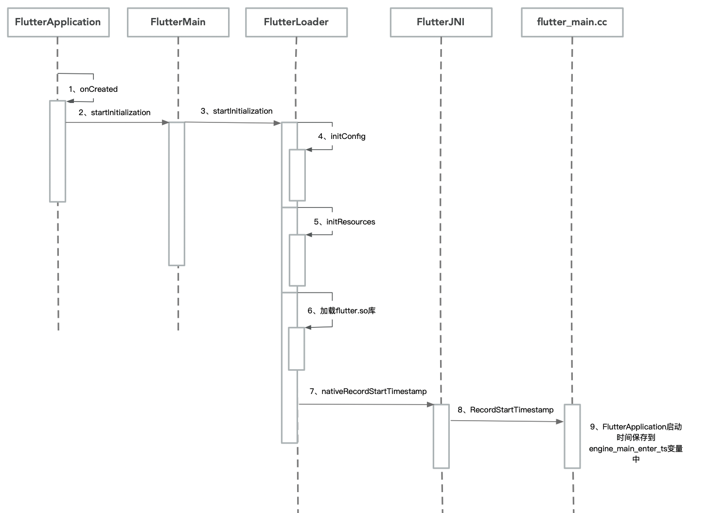

## Flutter启动流程源码分析

> Flutter的启动从java代码层面上看是离不开**FlutterApplication**、**FlutterActivity**这两个类的，下面我们就以flutter**1.12.13**版本为例来看下源码

### 一、FlutterApplication启动流程

#### 1.1、FlutterApplication.onCreate

```java
public void onCreate() {
	super.onCreate();
  // 初始化flutter相关资源
	FlutterMain.startInitialization(this);
}
```

#### 1.2、FlutterMain

> Flutter engine初始化类

```java
public static void startInitialization(@NonNull Context applicationContext) {
  if (isRunningInRobolectricTest) {
    return;
  }
  // 从1.9.1+hotfix.6时单独抽出了一个单例FlutterLoader
  FlutterLoader.getInstance().startInitialization(applicationContext);
}
```

#### 1.3、FlutterLoader

> 在apk中查找flutter resources并加载libflutter.so

**FlutterLoader-->startInitialization**

```java
public void startInitialization(@NonNull Context applicationContext) {
  // 初始化一个默认的Setting
  startInitialization(applicationContext, new Settings());
}
public void startInitialization(@NonNull Context applicationContext, @NonNull Settings settings) {
  // 首次执行时全局的settings还未被赋值，保证startInitialization只执行一次
  if (this.settings != null) {
    return;
  }
  // 保证在主线程中执行初始化操作
  if (Looper.myLooper() != Looper.getMainLooper()) {
    throw new IllegalStateException("startInitialization must be called on the main thread");
  }

  // 使用application的context.
  applicationContext = applicationContext.getApplicationContext();
	// 给全局的settings赋值
  this.settings = settings;

  long initStartTimestampMillis = SystemClock.uptimeMillis();
  // 初始化配置
  initConfig(applicationContext);
  // 初始化资源加载
  initResources(applicationContext);
	// 这个类的主要作用之一：加载libflutter.so
  System.loadLibrary("flutter");

  VsyncWaiter.getInstance(
    (WindowManager) applicationContext.getSystemService(Context.WINDOW_SERVICE))
    .init();

  long initTimeMillis = SystemClock.uptimeMillis() - initStartTimestampMillis;
  // 调用C层代码记录一下application启动的时间
  FlutterJNI.nativeRecordStartTimestamp(initTimeMillis);
}
```

**FlutterLoader-->initConfig**

> 加载androidManifest.xml中的flutter相关的配置：
>
> 1、aot模式时libapp.so库的位置（默认在lib/armeabi-v7a或者lib/arm64-v8a文件夹下）
>
> 2、flutter_assets资源文件的路径（默认在assets文件夹下）
>
> 3、JIT模式时vm_snapshot_data的位置（默认在debug时在flutter_assets文件夹下）
>
> 4、JIT模式时isolate_snapshot_data的位置（默认在debug时在flutter_assets文件夹下）

```java
private void initConfig(@NonNull Context applicationContext) {
  Bundle metadata = getApplicationInfo(applicationContext).metaData;

  // There isn't a `<meta-data>` tag as a direct child of `<application>` in
  // `AndroidManifest.xml`.
  if (metadata == null) {
    return;
  }

  aotSharedLibraryName =
    metadata.getString(PUBLIC_AOT_SHARED_LIBRARY_NAME, DEFAULT_AOT_SHARED_LIBRARY_NAME);
  flutterAssetsDir =
    metadata.getString(PUBLIC_FLUTTER_ASSETS_DIR_KEY, DEFAULT_FLUTTER_ASSETS_DIR);

  vmSnapshotData = metadata.getString(PUBLIC_VM_SNAPSHOT_DATA_KEY, DEFAULT_VM_SNAPSHOT_DATA);
  isolateSnapshotData =
    metadata.getString(PUBLIC_ISOLATE_SNAPSHOT_DATA_KEY, DEFAULT_ISOLATE_SNAPSHOT_DATA);
}
```

**FlutterLoader.initResources**

> 在debug或者JIT模式下，加载vm_snapshot_data、isolate_snapshot_data、kernel_blob.bin

```java
private void initResources(@NonNull Context applicationContext) {
  // 先清空data/user/0/package/cache目录下文件
  new ResourceCleaner(applicationContext).start();
	// debug或者JIT模式
  if (BuildConfig.DEBUG || BuildConfig.JIT_RELEASE) {
    // data/user/0/package/app_flutter目录
    final String dataDirPath = PathUtils.getDataDirectory(applicationContext);
    final String packageName = applicationContext.getPackageName();
    final PackageManager packageManager = applicationContext.getPackageManager();
    final AssetManager assetManager = applicationContext.getResources().getAssets();
    resourceExtractor =
      new ResourceExtractor(dataDirPath, packageName, packageManager, assetManager);
    
    // 资源加载到列表中
    resourceExtractor
      .addResource(fullAssetPathFrom(vmSnapshotData)) // fullAssetPathFrom是拼写flutter_assets全路径的方法
      .addResource(fullAssetPathFrom(isolateSnapshotData))
      .addResource(fullAssetPathFrom(DEFAULT_KERNEL_BLOB));
    
    // 启动一个AsyncTask任务，会将data/user/0/package/app_flutter目录下对应的vm_snapshot_data、isolate_snapshot_data、kernel_blob.bin的文件先删除，然后从apk安装目录的assets中复制新的文件使用
    resourceExtractor.start();
  }
}
```

#### 1.4、FlutterJNI

> 调用libflutter.so时用到的JNI方法封装

```java
// 记录application启动的时间
public static native void nativeRecordStartTimestamp(long initTimeMillis);
```

#### 1.5、flutter_main.cc

> 主要是定义了两个方法：nativeInit、nativeRecordStartTimestamp

```c++
bool FlutterMain::Register(JNIEnv* env) {
  static const JNINativeMethod methods[] = {
      // 。。。。。。省略其他代码
      {
        	// JNI方法nativeRecordStartTimestamp，转化成调用C++的RecordStartTimestamp方法
          .name = "nativeRecordStartTimestamp",
          .signature = "(J)V",
          .fnPtr = reinterpret_cast<void*>(&RecordStartTimestamp),
      },
  };
  // 。。。。。。省略其他代码
}
```

#### 1.6、libary_loader.cc

> 在加载libflutter.so时会触发JNI_OnLoad方法

```c++
// 注册FlutterMain的JNI方法
JNIEXPORT jint JNI_OnLoad(JavaVM* vm, void* reserved) {
  // 。。。。。。省略其他代码
	result = flutter::FlutterMain::Register(env);
  // 。。。。。。省略其他代码
}
```

*附FlutterApplication时序图*

